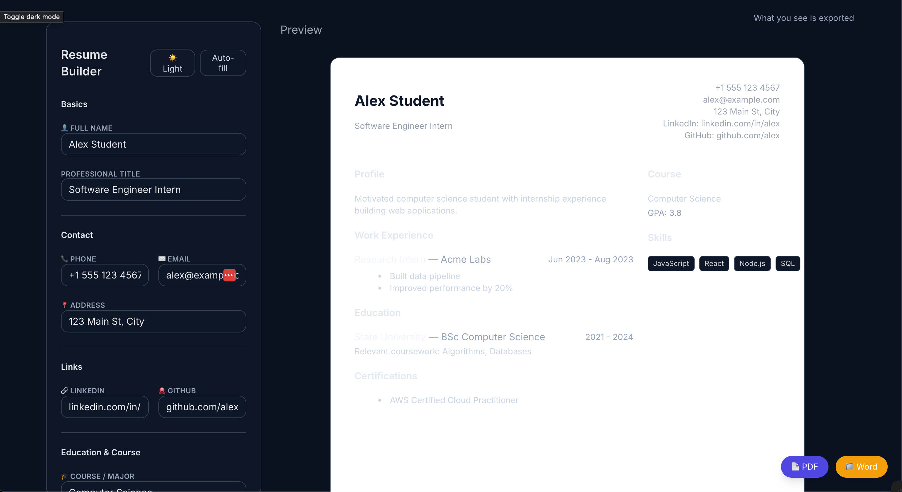

# Resume Builder

Interactive resume builder with live preview, PDF/Word export, and a clean two‑column layout. Built with React + Vite and handcrafted CSS (no Tailwind).



## Features

- Live preview: What you see is exported
- PDF export using `html2canvas` + `jsPDF`
- Word export (HTML `.doc` download)
- Dark mode toggle (class-based: `:root.dark`)
- A4 print styles and margins
- Rigid two-column editor/preview layout
- No CSS frameworks — small, maintainable CSS you own

## Quick Start

Requirements
- Node.js 20.19+ (or 22.12+)

Install and run
```
npm install
npm run dev
```

Build and preview
```
npm run build
npm run preview
```

If Vite warns about Node version, upgrade Node (e.g., via `nvm`).

## Usage

- Fill out Basics, Contact, Links, Education, Experience, Certifications
- Use “Save skills” to commit the skills list from the textarea
- Toggle dark/light using the button in the sidebar
- Export via “PDF” or “Word” buttons (bottom-right)

Tip: The exported PDF/Word reflects exactly what you see in the preview area.

## File Overview

- `src/ResumeBuilder.jsx` — Main app UI and export logic
- `src/index.css` — Handcrafted theme, components (`.btn`, `.input`, `.card`), layout utilities, and print styles
- `index.html` — App shell and Inter font include

The README references `./public/resume-builder.png`. Place your screenshot at `public/resume-builder.png` to render it on GitHub.

## Tech

- React + Vite
- `html2canvas` (DOM to image)
- `jsPDF` (image to PDF)

## License

ISC
